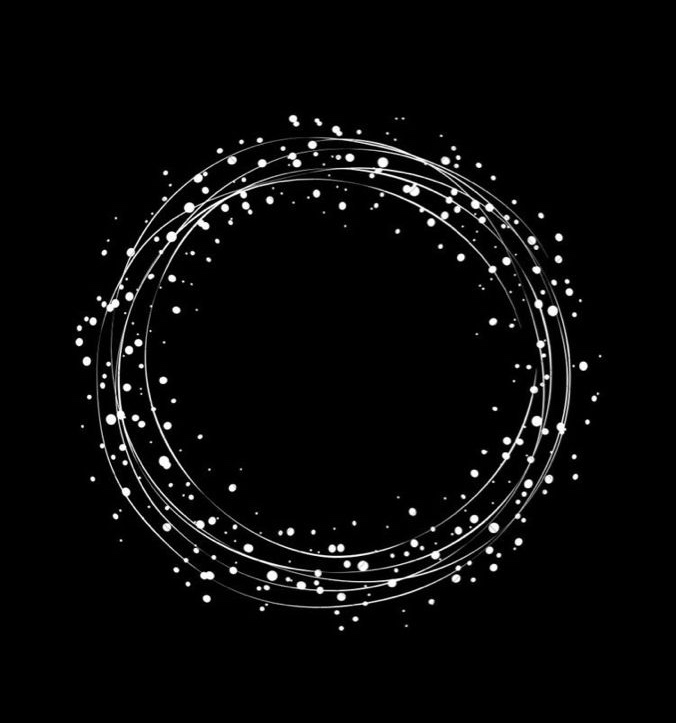

# 9103-major-project-personal-functioning-prototype-
9103 major project —— personal functioning prototype 

# Project: Wheels of Fortune - Interactive Dandelion Bloom

## How to Interact with the Artwork

This digital artwork, inspired by Pacita Abad's vibrant "Wheels of Fortune" series, transforms a static image into a dynamic, interactive experience.

* **Load the Page:** When you first load the webpage, you'll see a collection of colorful "wheels" interconnected across the screen. These wheels will **gradually fade into view**, building the initial composition.
* **Click to "Bloom":** **Move your mouse over any wheel and click on it.** When you click a wheel, all other wheels on the screen that share the **same primary color** as the clicked wheel will undergo a "dandelion bloom" effect. Their inner patterns (spokes and outer dots) will disappear, and a shower of colorful particles will burst outwards, mimicking dandelion seeds blowing away in the wind.
* **Press Spacebar to "Restore":** To undo the last "bloom" action and bring the wheels' inner patterns back, simply **press the Spacebar**. The particles will animate back towards their respective wheels, and the inner patterns will fade back into visibility, restoring the artwork to its previous state.

---

## Individual Approach to Animating the Group Code

My individual code significantly enhances the static "Wheels of Fortune" image by introducing an **interactive, reactive animation system**. While the group code likely focused on the static arrangement and drawing of the wheels, my contribution brings them to life through user input.

My individual code is primarily **driven by interaction**. Specifically, it responds to **mouse clicks** and **keyboard presses** (the spacebar).

### Animated Properties & Uniqueness:

My animation focuses on the following properties of the "Wheels of Fortune" image:

* **Visibility of Inner Wheel Components:** The core animation involves the **appearance and disappearance of the inner spokes and outer dots** of the wheels. When a wheel (and its color-matched peers) "blooms," these specific elements become transparent.
* **Particle Generation and Movement:** This is the most dynamic aspect. When a wheel blooms, its inner components are *not just hidden*; they are visually transformed into a **multitude of individual "dandelion particles"** that then float away and fade out.
* **Fade-in/Fade-out Transitions:** Both the initial loading of the wheels and the restoration process use **alpha transparency transitions** to create smooth fading effects, making the animations less jarring and more organic.
* **Particle Return Animation:** Uniquely, the spacebar action doesn't just make the inner patterns reappear; it triggers a **reverse animation where the "blown away" particles actively return** to their respective wheels before fading out completely, simulating a re-integration of the dispersed elements.

This approach is distinct from other potential animations (e.g., changing colors, scaling components, or revealing specific parts based on time or audio) because it focuses on a **transformative visual event triggered by user interaction**, involving both destruction and reconstruction of elements through particle animation.

---

## References and Inspiration

My primary inspiration for this interactive animation came from the **dandelion flower's lifecycle**—specifically, the moment its seeds are dispersed by wind. The idea was to take the robust, colorful "wheels" of Pacita Abad and give them a delicate, ephemeral quality, as if they could be "blown away" and then "re-collected."

* **Dandelion Dispersal:** The visual effect of particles scattering outwards and then fading away is directly inspired by time-lapse videos of dandelions releasing their seeds. I aimed to capture the organic, slightly unpredictable movement of these tiny elements.
 

The "restoration" aspect, where particles return, draws inspiration from concepts of **rewinding or regeneration in digital art and animation**, aiming to provide a satisfying visual "undo" that also echoes natural cyclical processes. 
 

---

## Technical Explanation

My code builds upon the group's static image generation by introducing several interactive and animation mechanisms:

1.  **Event Listeners (`mousePressed`, `keyPressed`):**
    * The `mousePressed()` function detects clicks on the canvas. It iterates through all `Wheel` objects. If a click occurs within a wheel's boundaries (`wheel.contains(mouseX, mouseY)`), it identifies all other wheels that share the **same primary color** (`colors[0]`) and triggers the "bloom" effect for them.
    * The `keyPressed()` function listens for keyboard input. When the **Spacebar** (`keyCode === 32`) is pressed, it retrieves the last recorded "blown away" state from `blownAwayHistory` and initiates the restoration process. These event listeners are fundamental to implementing **user control** (Week 5).

2.  **Wheel State Management (`isBlownAway`, `innerAlpha`):**
    * Each `Wheel` object now has an `isBlownAway` boolean property. When true, the `drawOuterDots()` and `drawSpokes()` methods within the `Wheel` class cease to render, effectively "hiding" these inner patterns.
    * A `innerAlpha` property, along with `targetInnerAlpha` and `fadeSpeed`, is used to control the transparency of the inner wheel patterns. The `updateAlpha()` method, called in `draw()`, gradually changes `innerAlpha`, creating the **fade-in effect** when wheels are initialized or restored. This uses basic animation principles, building on `setInterval()` concepts (Week 5) but implemented in the `draw()` loop for smoother frame-based animation.

3.  **DandelionParticle Class (Object-Oriented Programming - Week 7):**
    * This new class is central to the dynamic animation. Each `DandelionParticle` instance represents a single "seed" or "fragment" of the blown-away wheel.
    * **Instantiation:** When a wheel "blooms," multiple `DandelionParticle` objects are created. Their initial positions are set to the exact locations of the spokes' endpoints and outer dots. Their `type` property (`'spoke'` or `'outerDot'`) allows for different rendering (line vs. circle).
    * **Movement (`update()`):** Each particle has its own `vel` (velocity), `windX`, and `windY` properties, providing slightly randomized, natural-looking dispersion. The `update()` method incrementally changes the particle's `x` and `y` coordinates, `rotation`, `rotationSpeed`, `alpha`, and `size`, creating the illusion of floating away and fading. This leverages basic vector math and `random()` (Week 2, Week 6).
    * **Return Mechanism:** When `isReturning` is set to `true`, the `update()` method switches to a `lerp()` (linear interpolation) function to smoothly move the particle back towards its `targetX` and `targetY` (its original position on the wheel), while simultaneously fading it out. This demonstrates **easing techniques** (Week 10).

4.  **`blownAwayHistory` Array:**
    * This array acts as a simple "undo stack." When a group of wheels is blown away, a copy of their state (specifically, the `Wheel` objects themselves) is pushed onto this array.
    * Pressing the **Spacebar** `pop()`s the last state from the array, allowing the application to restore those specific wheels. This demonstrates **array manipulation** (Week 4) for managing program state.

**References:**

* **p5.js Documentation:** All core drawing functions (`circle()`, `line()`, `fill()`, `stroke()`, `translate()`, `rotate()`, etc.) and utility functions (`random()`, `dist()`, `map()`, `lerp()`, `atan2()`, `cos()`, `sin()`, `TWO_PI`, `millis()`, `constrain()`) are from the p5.js library, which we set up in **Week 6**.
* **Object-Oriented Programming (OOP):** The use of `class Wheel` and `class DandelionParticle` directly applies concepts taught in **Week 7**, encapsulating properties and behaviors for better code organization and reusability.
* **Responsive Design:** The `windowResized()` function, as covered in **Week 9**, ensures the canvas adapts to different screen sizes, and `initializeArtwork()` is called again to re-layout the wheels appropriately.

